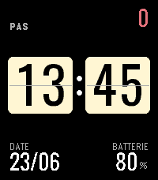
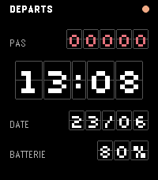
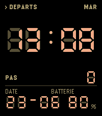
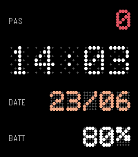
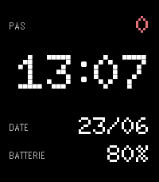
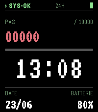
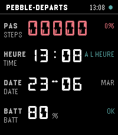
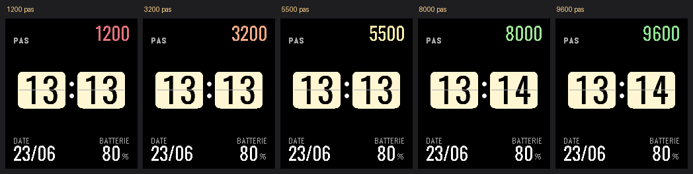

<div align="center">

# FlipBoard

### A family of departure-board watchfaces for the Pebble Time 2

*Split-flap, dot-matrix, segment and LED takes on the airport/train board — one shared engine, seven faces.*

-orange)


<br>






</div>

---

## The faces

Each face is its own `.pbw` (its own Pebble Store app) but shares a common engine, data model and step-goal colour ramp. The departure-board idea, seven ways:

<table>
<tr>
<td align="center" width="33%"><br><b>STIPPLE</b><br><sub>Doto dot-grain on a stippled e-paper field</sub></td>
<td align="center" width="33%"><br><b>SOLARI</b><br><sub>Mechanical split-flap board (Silkscreen)</sub></td>
<td align="center" width="33%"><br><b>IVOIRE</b><br><sub>Ivory flip-clock — the one light face (Oswald)</sub></td>
</tr>
<tr>
<td align="center"><br><b>APOLLO</b><br><sub>Aerospace console terminal (VT323)</sub></td>
<td align="center"><br><b>QUAI</b><br><sub>Amber 7-segment platform board (DSEG)</sub></td>
<td align="center"><br><b>CONCOURSE</b><br><sub>Bilingual 14-segment board (DSEG)</sub></td>
</tr>
<tr>
<td align="center"><br><b>LUMEN</b><br><sub>LED dot-matrix departure board · <code>v0.1</code></sub></td>
<td colspan="2" valign="middle"><sub>Every face shows the same four zones — <b>steps</b>, <b>time</b>, <b>date</b>, <b>battery</b> — laid out in its own typographic world. The hero time runs a brief split-flap fold on the minute change, then stops (negligible battery cost).</sub></td>
</tr>
</table>

## Colour-coded steps

The step count is coloured against your daily goal, so a glance tells you how you are tracking — warm red near zero, through amber and yellow, to green as you reach the goal:

<div align="center"></div>

## Phone settings

Faces carry a settings page in the Pebble phone app (built with [Clay](https://github.com/pebble-dev/clay)):

- **Daily step goal** — a slider; the colour ramp follows whatever target you set.
- **Language** — labels in Français, English, Deutsch, Español, Italiano, Nederlands, Português, Polski or Svenska. You can also **shake** your wrist to cycle to the next one.
- **LUMEN only — ghost-grid intensity** — a 0–100 % slider for the LED grid contrast, rendered with ordered (Bayer) density dithering for a smooth sweep.

## Building

Requires the [Pebble SDK](https://github.com/coredevices/pebble-tool) (the rebble / Core Devices fork).

```bash
cd faces/ivoire          # or any other face
npm install              # pulls pebble-clay for the settings page
pebble build
pebble install --emulator emery
```

Each face targets **Emery** (Pebble Time 2, 200×228, 64-colour) by default.

## Repository layout

```
FlipBoard/
├── shared/flipboard.h     # common engine (data model, ramp, i18n, AppMessage)
├── faces/<name>/          # one buildable watchface per folder
│   ├── src/c/main.c       #   the face: a render function over the engine
│   ├── src/pkjs/          #   Clay phone settings (config.js + index.js)
│   └── resources/         #   baked glyph sprites, fonts, menu icon
├── tools/gen_glyphs.py    # bakes anti-aliased glyph sprite sheets
├── design_handoff_.../    # the original design mockups (HTML + JSX)
└── screenshots/           # the images in this README
```

> The hero digits on most faces are **pre-baked anti-aliased sprites**: Pebble rasterises TTFs to 1-bit, which looks ragged on thin type, so `tools/gen_glyphs.py` bakes the glyphs with anti-aliasing on the face background and quantises every pixel to the 64-colour palette.

## Credits

Fonts, all under the [SIL Open Font License](https://openfontlicense.org):
[Oswald](https://fonts.google.com/specimen/Oswald),
[Doto](https://fonts.google.com/specimen/Doto),
[VT323](https://fonts.google.com/specimen/VT323),
[Silkscreen](https://fonts.google.com/specimen/Silkscreen),
and [DSEG](https://github.com/keshikan/DSEG) (7- & 14-segment).

Phone settings use [Clay](https://github.com/pebble-dev/clay). Built for the Pebble revival by [Core Devices / rePebble](https://repebble.com).

## License

[PolyForm Noncommercial 1.0.0](LICENSE) — free to use, modify and share for any **noncommercial** purpose; **selling is not permitted**. Bundled fonts keep their own OFL terms.
